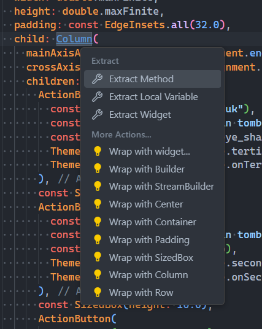

# goodbye_stale_mobile

Implementasi mobile dari [Goodbye::Stale](https://github.com/thorbert-anson-shi/goodbye-stale) menggunakan Flutter.

## Tugas Individu 7

### Jelaskan apa yang dimaksud dengan stateless widget dan stateful widget, dan jelaskan perbedaan dari keduanya.

Pada dasarnya, widget merupakan setiap komponen visual yang bisa dilihat pada layar, baik itu _container_, teks, ikon, maupun _padding_ antara widget-widget lainnya.

Sebuah widget dapat memiliki **state** atau tidak memiliki state. State merupakan data pada suatu widget yang dapat berubah dengan seiring berjalannya waktu setelah pembuatan widget tersebut.

Sesuai namanya, sebuah stateless widget tidak memiliki state, dan tidak akan mengalami perubahan setelah pembuatan widget. Sebagai contoh, sebuah _button_ yang digunakan untuk me-_redirect_ pengguna ke halaman lain tidak akan perlu berubah selama masa hidupnya. Oleh karena itu, ia dapat diklasifikasikan sebagai stateless widget.

Stateful widget adalah widget yang memiliki state, yang berarti ia dapat mengalami perubahan pada statenya setelah pembuatan widget. Sebagai contoh, pada sebuah aplikasi _To-do List_, komponen list pada _to-do list_ harus dapat menyimpan data mengenai entri-entri _to-do list_ - yang dapat berubah dengan penambahan atau pengurangan entri. Oleh karena itu, ia termasuk sebuah stateful widget.

Secara garis besar, pembuatan stateless widget lebih murah karena karena kontennya statis, dan tidak ada logika penyimpanan state yang perlu diimplementasikan. Namun, apabila sebuah widget akan mengalami perubahan terhadap data yang disimpan, maka diperlukan sebuah stateful widget untuk merefleksikan state ini secara dinamis.

### Sebutkan widget apa saja yang kamu gunakan pada proyek ini dan jelaskan fungsinya.

Pada proyek ini, ada beberapa widget yang digunakan untuk membangun tampilan aplikasi. Berikut adalah daftar widget tersebut beserta fungsinya:

#### Scaffold

- Fungsi: Scaffold adalah widget yang menyediakan struktur dasar untuk halaman aplikasi. Ini adalah kerangka kerja untuk membuat layar aplikasi Flutter.
- Penggunaan dalam proyek: Scaffold digunakan di dalam MyHomePage untuk menampung seluruh struktur halaman, termasuk AppBar di atas dan bagian body yang menampung tombo-tombol.

#### AppBar

- Fungsi: AppBar adalah widget untuk menampilkan bar navigasi di bagian atas layar. Biasanya digunakan untuk memberikan judul halaman dan ikon-ikon tindakan (seperti tombol kembali atau menu).
- Penggunaan dalam proyek: AppBar digunakan di dalam Scaffold untuk menampung judul aplikasi.

#### Container

- Fungsi: Container adalah widget fleksibel yang digunakan untuk membungkus dan mengatur widget lain. Container dapat digunakan untuk mendefinisikan spacing dan layout dari interface aplikasi.
- Penggunaan dalam proyek: Saya menggunakan Container seperti <code>div</code> pada HTML, yakni sebagai kontainer fleksibel untuk keseluruhan konten aplikasi.

#### Column

- Fungsi: Column adalah widget tata letak yang menyusun widget anak-anaknya secara vertikal. Berguna untuk membuat struktur bertingkat seperti daftar atau baris widget.
- Penggunaan dalam proyek: Column digunakan untuk menyusun button secara vertikal.

#### ElevatedButton

- Fungsi: ElevatedButton adalah tombol yang menonjol, digunakan untuk memberikan aksi saat diklik.
- Penggunaan dalam proyek: ElevatedButton digunakan di dalam ActionButton sebagai template dasar yang dikustomisasi dengan argumen oembuatan ActionButton.

#### SnackBar

- Fungsi: SnackBar adalah widget untuk menampilkan pesan sementara di bagian bawah layar. Biasanya digunakan untuk memberikan umpan balik singkat kepada pengguna, seperti notifikasi atau hasil dari sebuah tindakan.
- Penggunaan dalam proyek: SnackBar digunakan di dalam ActionButton untuk menampilkan pesan saat tombol diklik.

#### SnackBarAction

- Fungsi: SnackBarAction digunakan untuk menambahkan button yang dapat ditekan pada SnackBar.
- Penggunaan dalam proyek: Di dalam SnackBar, terdapat SnackBarAction dengan label “Undo” yang menghilangkan SnackBar ketika ditekan.

#### Icon

- Fungsi: Icon digunakan untuk menampilkan ikon. Ikon dapat ditambahkan pada aplikasi untuk memberikan konteks visual tambahan.
- Penggunaan dalam proyek: Icon digunakan di setiap ActionButton untuk menampilkan ikon yang sesuai dengan fungsi button yang bersangkutan.

#### Text

- Fungsi: Text adalah widget untuk menampilkan teks di layar.
- Penggunaan dalam proyek: Text digunakan untuk menampilkan judul aplikasi di AppBar dan juga untuk label setiap tombol pada ActionButton.

#### SizedBox

- Fungsi: SizedBox adalah widget untuk menambahkan ruang kosong atau mengatur ukuran tertentu di antara widget lain.
- Penggunaan dalam proyek: SizedBox digunakan untuk memberikan jarak vertikal antara ActionButton dan juga jarak horizontal antara teks dan ikon di dalam ActionButton.

### Apa fungsi dari setState()? Jelaskan variabel apa saja yang dapat terdampak dengan fungsi tersebut.

Fungsi <code>setState()</code> adalah fungsi yang dapat dipasangkan pada suatu StatefulWidget yang akan memanggil fungsi <code>build()</code>. Penjalanan fungsi <code>build()</code> (yang menyebabkan re-_render_ dari halaman aplikasi) saat terjadi perubahan state akan memastikan bahwa data yang ditunjukkan kepada user merupakan data yang terbaru yang terdapat pada aplikasi.

Variabel yang terdampak oleh pemanggilan fungsi <code>setState()</code> adalah variabel yang didefinisikan di dalam class <code>State</code> suatu stateful widget.

### Jelaskan perbedaan antara const dengan final.

Dalam bahasa pemrograman Dart, variabel yang dideklarasikan dengan keyword <code>const</code> harus sudah diketahui nilainya saat kompilasi. Sementara, variabel yang dideklarasikan sebagai final hanya perlu diketahui nilainya saat waktu runtime.

Pada kedua jenis variabel ini, nilai yang disimpan variabel bersifat immutable. Tetapi, apabila nilai yang disimpan merupakan sebuah <code>Object</code>, maka hanya object yang diassign ke variabel <code>final</code> yang dapat diubah atributnya.

### Jelaskan bagaimana cara kamu mengimplementasikan checklist-checklist di atas.

Untuk membuat dan berpindah folder ke sebuah project <code>flutter</code>, saya menjalankan command berikut:

```bash
flutter create <nama_aplikasi>
cd <nama_aplikasi>
```

Kemudian, untuk mengubah source code dari aplikasi ini, saya berpindah ke folder <code>lib</code>, yang mengandung file <code>main.dart</code>. File ini merupakan entry point dari kompilasi aplikasi (dari function <code>runApp()</code>).

Untuk mendefinisikan tampilan home page, saya memindahkan logika display home page ke file yang terpisah yang saya namakan <code>home.dart</code>. Agar <code>main</code> dapat menggunakan widget yang didefinisikan pada <code>home</code>, saya menambahkan import pada bagian atas file <code>main</code>.

```dart
import 'package:goodbye_stale_mobile/home.dart';
```

Pada widget home page, saya mendefinisikan suatu container yang mengambil tempat keseluruhan halaman. Saya melakukan hal ini dengan menambahkan widget <code>Container</code> sebagai salah satu <code>children</code> dari <code>body</code> aplikasi, kemudian mengatur ukuran container supaya sebesar layar perangkat.

```dart
class MyHomePage extends StatelessWidget {
  const MyHomePage({super.key});

  @override
  Widget build(BuildContext context) {
    return Scaffold(
      // ...appBar and such
      body: Container(
        width: double.maxFinite, // set width to parent width
        height: double.maxFinite, // set height to parent height
        padding: const EdgeInsets.all(32.0),
        // ...contents of container
      ),
    );
  }
}

```

Untuk mengenkapsulasi logika dari sebuah button, saya membuat widget terpisah yang memiliki dasar sebuah <code>ElevatedButton</code>, yakni sebuah <code>ActionButton</code>.

```dart
class ActionButton extends StatelessWidget {
  final Text text;
  final Text snackBarText;
  final Icon icon;
  final Color bgColor;
  final Color fgColor;

  const ActionButton(
      this.text, this.snackBarText, this.icon, this.bgColor, this.fgColor,
      {super.key});

  @override
  Widget build(BuildContext context) {
    return ElevatedButton(
      onPressed: () {
        final snackBar = SnackBar(
          content: snackBarText,
          action: SnackBarAction(
            label: 'Undo',
            onPressed: () {
              ScaffoldMessenger.of(context).hideCurrentSnackBar();
            },
          ),
        );

        ScaffoldMessenger.of(context).showSnackBar(snackBar);
      },
      style: ElevatedButton.styleFrom(
        backgroundColor: bgColor,
        foregroundColor: fgColor,
        minimumSize: const Size.fromHeight(50),
        shape: RoundedRectangleBorder(
          borderRadius: BorderRadius.circular(16.0),
        ),
      ),
      child: Row(
        mainAxisSize: MainAxisSize.min,
        children: [
          text,
          const SizedBox(width: 10.0),
          icon,
        ],
      ),
    );
  }
}
```

Secara kasar, widget ini adalah widget yang mengandung sebuah button yang akan menampilkan suatu snackbar dengan pesan tertentu setelah button tersebut ditekan.

Untuk menggunakan <code>ActionButton</code> ini, kita menginisialisasikan sebuah <code>ActionButton</code> pada widget home page dengan argumen yang didefinisikan pada widget.

Sebagai contoh, berikut adalah pembuatan <code>ActionButton</code> pertama pada aplikasi:

```dart
// ...
ActionButton(
    const Text("Lihat Daftar Produk"),
    const Text("Kamu telah menekan tombol Lihat Daftar Produk"),
    const Icon(Icons.remove_red_eye_sharp),
    Theme.of(context).colorScheme.tertiary,
    Theme.of(context).colorScheme.onTertiary,
),
// ...
```

Selama proses pembuatan suatu komponen kompleks, kita dapat menambahkan atau menghapus widget dengan mudah dengan bantuan VSCode dan extension <code>Flutter</code>.

Sebagai contoh, kita dapat me-_wrap_ sebuah widget dalam suatu <code>Container</code> atau <code>Column</code> dengan menekan Ctrl+. lalu memilih pilihan yang sesuai dari context menu.



Dengan ini, kita dapat memitigasi salah satu kekurangan dari Flutter, yakni banyaknya nesting yang dapat membuat kode sulit dibaca. Dengan menggunakan extension <code>Flutter</code>, kita dapat menambahkan dan menghapus widget dengan mudah dan bebas bug.
